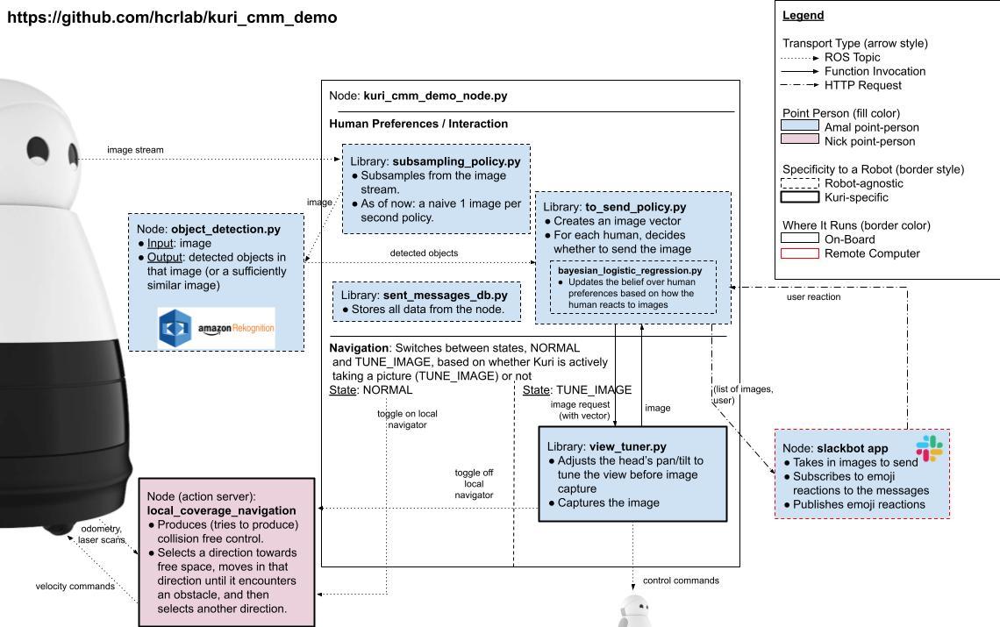

# Kuri CMM Demo (Sp 2021)

This repository contains code to run the UW+UCSC demo for the [Curious Minded Machine](https://cmm.usa.honda-ri.com/) project. The demo is broadly divided into three components: navigation, decision making, and interaction. These components broadly correspond to the `local_coverage_navigation`, `kuri_cmm_demo`, and `slackbot` repositories, respectively.

This readme provides an overview of the demo and a getting started guide.

## Overview

The below diagram provides a visual overview of the architecture of the system.

## Getting Started

### Hardware Requirements
- A Kuri robot. The decision-making and and interaction components are robot agnostic (as of now), but the navigation component is robot-specific.
- A remote computer, configured to enable a Flask app to run on it on ports 8193 and 8194 (instructions under "Slackbot" below). This computer should always be on, to recieve user responses to Slack messages.

### Running Code On-Board the Robot: Dockerfiles

Both the `local_coverage_navigation` and the `kuri_cmm_demo` directories use Docker containers to isolate ROS versions and ensure the appropriate dependencies are installed. The appropriate dockerfiles are included in the directories. Please refer to our [wiki on using Docker with Kuri](https://github.com/hcrlab/wiki/wiki/Robots:-Kuri:-Docker) for more details.

NOTE: For running the overall demo, use the Dockerfile in `kuri_cmm_demo`. The Dockerfile in `local_coverage_navigation` should chiefly be used to run the local navigator in isolation.

### Slackbot

Refer to the [readme in the slackbot directory](./slackbot/README.md). This code must run on a remote computer, so that it is guarenteed to be always on.

### Navigation

Refer to the [readme in the local_coverage_navigation directory](./local_coverage_navigation/README.md).

### Kuri CMM Demo

This node is the executive node; it brings together the slackbot, navigation, and decision-making aspects of the demo. Refer to the [readme in the kuri_cmm_demo directory](./kuri_cmm_demo/README.md).

### clean.py

Both the Slackbot and the code running on-board the robot store data in respective `sent_messages_database.pkl` files, as well as in CSVs and as stored image files. The downside of this is that if you change the configuration file, or other aspects of the setup, then those cached files don't update and the system does not work as expected. To alleviate this, anytime you want to re-run the server and/or robot from scratch, run `python3 clean.py`. The prompts on-screen will walk you through how to delete files and have you verify the commands before running them.
